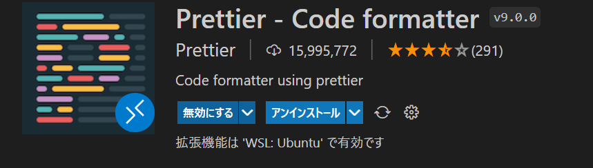

## 事の発端

VSCodeでmarkdownをフォーマットしていると、「markdown の記事」や「第 1 章」のように、英字と日本語の間で半角スペースが入る（特に後者の数字と日本語パターンは目立ってしょうがない）

VSCodeには拡張機能としてPrettierを導入していて、どうやらコイツが悪いらしいので、Prettierのプラグインで改善してみた。

## 導入

VSCodeに[Prettier](https://marketplace.visualstudio.com/items?itemName=esbenp.prettier-vscode)の拡張機能を導入する。  


次に、[プラグインのリポジトリ](https://github.com/tats-u/prettier-plugin-md-nocjsp#readme)を参照し、インストールを実施する。

インストール方法にはグローバルへインストールする方法と、プロジェクトへインストールする2通りがある。  
あまりグローバルの環境を汚したくないので、プロジェクトへインストールする方式を取った。

```bash
$ npm i -D prettier-plugin-md-nocjsp
$ npm i -D prettier --save-exact
# --save-exactオプションは現在のインストールのバージョンから自動的に上がらないようにする
```

`.prettierrc`をプロジェクトルートへ追加し、以下の設定を追記する。

```json
{
  "overrides": [
    {
      "files": ["*.md"],
      "options": {
        "parser": "markdown-nocjsp"
      }
    }
  ],
  ... // 他の設定等
}
```

これでフォーマット時にスペースが入らないようになった。

## 参考

[PrettierでMarkdownをフォーマットしたときの英語と日本語の間に入るスペースをどうにかする](https://qiita.com/kumapo0313/items/92d1597da5f3752f6584)  
[prettier-plugin-md-nocjsp](https://github.com/tats-u/prettier-plugin-md-nocjsp#readme)
