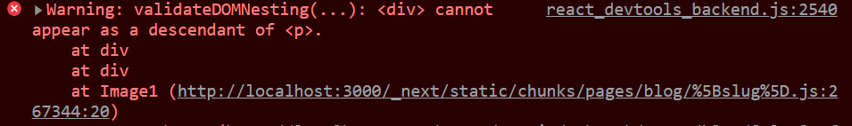

## 概要

React-Markdownでmarkdownを変換する際、画像についても`<p>`で囲まれる。  
普通に<`image>`で画像を表示させる場合はこれで問題ないのだが、本ブログのように`next\image`で最適化をしている場合などは、`<image>`だけではなく`<div>`でも囲まれることになる。するとどうなるか。



Chromeにめっちゃ怒られる。正確にはReactに怒られる。  
[HTML5のコンテンツモデル](https://developer.mozilla.org/ja/docs/Web/Guide/HTML/Content_categories)（コンテンツカテゴリともいうらしい）に沿っていないため、とのこと。`<p>`と`<div>`は同じフローコンテンツのカテゴリーに含まれるため、入れ子構造にできない[^first]。  

[^first]: 一部例外はある

これを回避するため、Remark公式のプラグイン、[remark-unwrap-images](https://github.com/remarkjs/remark-unwrap-images)を導入する。

## インストール

以下コマンドでプロジェクトへインストールする

```sh
$ npm install remark-unwrap-images
```

