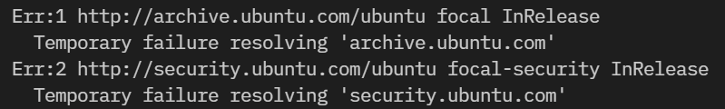

## 概要

Windows側でWireguardを有効にしている場合、WSL2で`apt update`等のコマンドで通信できなくなる。



原因は[WSL2側で名前解決ができなくなるため](https://esc.sh/blog/wsl2-no-internet-vpn/)とのことだったので、修正してみた。

## 解決策

`/etc/resolv.conf`を開く

```conf:/etc/resolv.conf
# This file was automatically generated by WSL. To stop automatic generation of this file, add the following entry to /etc/wsl.conf:
# [network]
# generateResolvConf = false
nameserver 172.23.0.1
```

nameserverを好きなPublic DNSのアドレスに変更する。(要管理者権限)

```conf
nameserver 1.1.1.1
```

`apt update`でエラーが解消していることを確認する。


DNSの設定はWSLで上書きされる。
これを防ぐため、`/etc/wsl.conf`に以下追記する。(要管理者権限)

```conf:/etc/wsl.conf
[network]
generateResolvConf = false
```

## 参考

[No internet on WSL2 while on VPN (Wireguard)](https://esc.sh/blog/wsl2-no-internet-vpn/)
