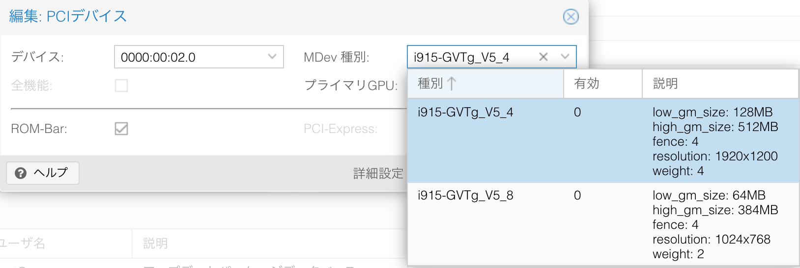

## 経緯

新しく組んだ自宅のデスクトップは以下の構成。

| 項目 | 内容          |
| ---- | ------------- |
| CPU  | Core i5 10400 |
| MEM  | 32GB          |
| SSD  | 1TB           |
| HDD  | 2TB           |
| GPU  | **なし**      |

えー、はい。グラフィックボードは無いです。  
最近[^first]の半導体不足の煽りを受け、今コスパの悪いグラフィックボードは乗っける気になりませんでした。
ただ録画のエンコードだけは必要だったので、内蔵GPU付きのCPUを選択しました。

[^first]: 2022/02現在。まだグラボが買えないほどではないが、エントリーモデルは2020年の2倍以上の金額

最初はVMWareで仮想化していたのですが、毎度カーネルパニックを起こすので使い物にならず。
仕方がないのでQEMU(Proxmox VE)で再度仮想環境を構築し、iGPUパススルーを試していました。

そんな中、[intel GPUの仮想化](https://kagasu.hatenablog.com/entry/2021/01/29/111659)なる話を見つけました。
内蔵GPUをPCIパススルーするのはなかなか難易度が高く、安定性も劣ります。

しかしながら仮想GPUを作成しゲストOSにマウントするのは、ホストOSから切り離すわけではないので、安定性も向上するため理にかなっている(複数GPU仮想化可能なら、なお良し)と感じ、今回採用しました。

少し設定が複雑（といってもLinuxカーネルの設定ぐらいですが）だったので記事に残します。  
あとは万が一故障した際の参考メモ。

## 導入

### 環境

- Core i5 10400
- Promox VE 7.1.8

### 設定

Proxmoxの導入は省きます。

#### カーネルモジュール

rootログイン後、カーネルモジュールを設定する。

```
# nano /etc/module
kvmgt
```

[公式の手順](https://github.com/intel/gvt-linux/wiki/GVTg_Setup_Guide#321-build-the-initrd-initial-ramdisk)では`vfio_iommu_type1`、`vfio_mdev`が必要と記載があるが、上記Ver以降のProxmoxであればカーネルに標準で組み込まれているので不要。確認したい場合は`lsmod`を使用する。

また、`xengt`はintel 第11世代以降のGPUでなければ不要。

#### GRUB

ブートローダーを設定する。

```
# nano /etc/default/grub

GRUB_CMDLINE_LINUX_DEFAULT="quiet intel_iommu=on iommu=pt i915.enable_gvt=1 kvm.ignore_msrs=1"
```

設定した後、反映および再起動。

```
# update-grub
# reboot
```

カーネルのメッセージを確認し、iommuが有効化されているかを確認する。

```
# dmesg | grep -E "IOMMU|enabled"
[    0.057526] DMAR: IOMMU enabled
```

#### iGPUのPCIアドレス確認

`lspci`で確認する。

```
# lspci | grep VGA
00:02.0 VGA compatible controller: Intel Corporation CometLake-S GT2 [UHD Graphics 630] (rev 03)
```

#### Proxmox VE

Promox VEの管理画面にログインし、仮想GPUを導入したい仮想環境を選択。  
PCIデバイスの追加の画面で**MDev種別**を設定する。



種別が2つ存在するが、簡潔に説明すると

1. スペックは高いが仮想GPUの数は1つ
2. スペックは低いが仮想GPUの数は2つ

場合に応じて使い分ける。

## 参考

- [ProxmoxでIntel GVT-gを利用してiGPUを仮想化して使用する方法](https://kagasu.hatenablog.com/entry/2021/01/29/111659)
- [Intel GVT-g - ArchWiki](https://wiki.archlinux.jp/index.php/Intel_GVT-g)
- [GVTg_Setup_Guide · intel/gvt-linux Wiki](https://github.com/intel/gvt-linux/wiki/GVTg_Setup_Guide)
