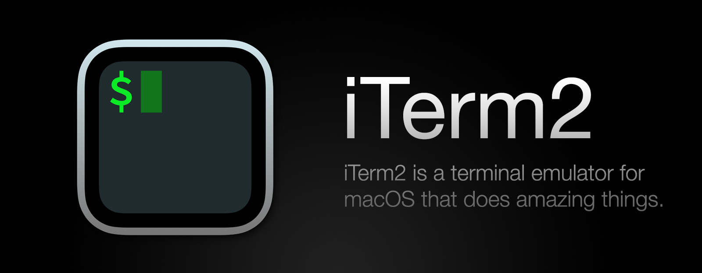

## 経緯

円高が気になってMacBook Airを購入しました。
Apple SiliconのMacは初めてですが、今のところ変化ありません。キーボードを~~イキって~~カッコいいと思ってUSキーボードにしましたが、正直Controlのキーの位置にブチ切れそうです。

それはさておき、Macを更新したら色々とやることがあります。データの移行はもちろんのことですが、設定も一からすることになります。
（移行ツールはありますが、intel Macからの移行なので一から設定し直した方が不具合がなさそうだった。）

Macのターミナルのカスタマイズ方法をメモってなくて完全に頭から飛んでたのでメモ程度に紹介します。

## インストール

### [iTerm2](https://iterm2.com/)


ターミナルの上位互換のソフトウェアをインストールします。

### フォント

コンソールに求められるフォントの要件は以下3つ。

- `0`と`o`、`I`、`l`などの混同しやすい文字が見分けがつくこと
- 等幅フォントであること
- Nerd Fonts[^1]が入っていること

[^1]: [Nerd Fonts](https://www.nerdfonts.com/)はグリフ（アイコン）の数が多い開発者向けフォントにパッチを適用するプロジェクトです。具体的には、Font Awesome、Devicons、Octiconsなど、人気のある「アイコンフォント」のグリフを大量に追加します。

これらを踏まえてオススメのフォントは以下の通り。

- [PlemolJP](https://github.com/yuru7/PlemolJP)

  私の一番おすすめ。

- [Source Code Pro](https://github.com/ryanoasis/nerd-fonts/tree/master/patched-fonts/SourceCodePro)

  英語だと一番おすすめ

- [HackGen](https://github.com/yuru7/HackGen)

  PlemolJPが合わない方はこちらもおすすめ

私は文字幅比率を 半角3:全角5 にした「PlemolJP35 Console NFJ」を使っています

## zshのカスタマイズ

流石に今時のmacOSは標準のシェルはzshだと思います。が、違う場合はzshに変えることをオススメします。
記事書いている途中にベストプラクティスがもう1パターンあることに気づいたので、2パターンに分けて記載します。

### [Prezto](https://github.com/sorin-ionescu/prezto)

zshのライブラリで一番有名なのは[Oh My Zsh](https://github.com/ohmyzsh/ohmyzsh)だと思いますが、若干もっさりしているのでPreztoにしていました。  
今回は導入しなかったのでインストール方法は省略し紹介だけに留めますが、導入方法は[ここ](https://github.com/sorin-ionescu/prezto#installation)の通りです。

Preztoを使用していて一番なところはそのカスタマイズ性の良さにあります。標準で複数のthemeから選べ、何より`powerlevl10k`のテーマが選べるのが決め手でした。


こんな感じでイケイケになります。その他のthemeは導入後`prompt -l`コマンドによりリスト形式で確認することができます。

### starship


GitHubでzshのタグで「Best Match」上から順に並べて見ている際に見つけました、Rust製のプロンプトです。ほとんどのシェルとOSをカバーする(WindowsのPowershellも対応、すごい)のでどんなシェルでもイケイケにできます。

インストールはmacOSでhomebrewが導入されている場合、コマンドで一発です。

```sh
brew install starship
```

設定も.zshrcに一行書くだけです。

```sh:.zshrc
eval "$(starship init zsh)"
```


詳細な設定方法は公式に記載があるのですが、まだ設定を詰めていないので追記予定。

## さいきんのこと

「ぼっち・ざ・ろっく」のアニメにハマっています。  
（ひとりちゃんのパロディが脳内再生されて汚染されています。たすけて）  
今季はガンダムもチェンソーマンもBLEACHもSPY FAMILYもあるので時間が余裕で溶けます。どうしよう。
